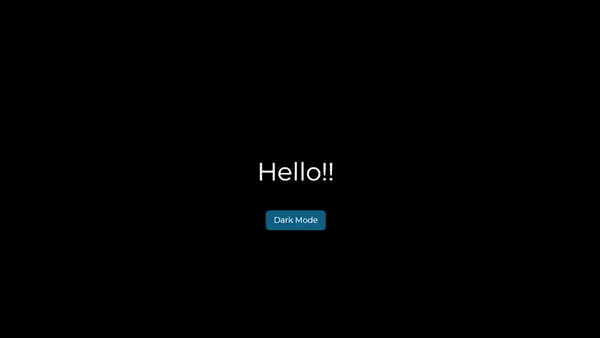

## Simple but useful react projects

+ All the projects are documented, Feel free to use them while  **learning React**.

+ Below I showcase the projects. The focus is not on styling, Just some projects that their **logic** works.

---

1. Accordion Menu (with single select and multi select option):

---

2. Random Color Generator (Generating HEX and RBG color codes):

---

3. Start Rating:

---

4. Image Slider (Fetching images from [picsum.photos](https://picsum.photos) and using them in a slide show):

---

5. Load More (Fetching product data from [dummyjson.com](https://dummyjson.com). User can load more data at anytime):

---

6. Tree Menu (Getting the needed data and show all the items and their children using recursion):

---	

7. Theme Switch (This not meant to be a dark/light theme component. Just a simple practice for making custom hooks. This component uses local storage to save the user's theme):

---

8. 
