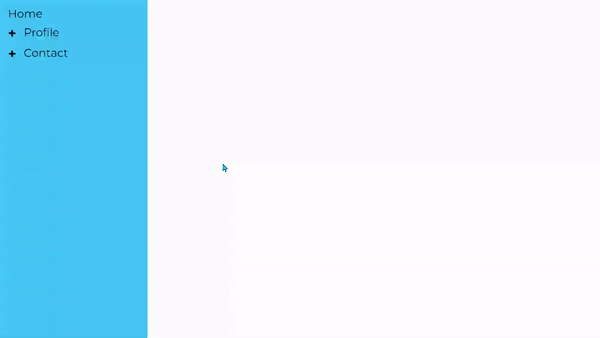

## Simple but useful react projects

+ All the projects are documented, Feel free to use them while  **learning React**.

+ Below I showcase the projects. The focus is **not on styling** , Just some projects that their **logic** works.

+ I've used TailwindCSS to style this mini projects.

---

1. Accordion Menu (with single select and multi select option):

---

2. Random Color Generator (Generating HEX and RBG color codes):

---

3. Start Rating:

---

4. Image Slider (Fetching images from [picsum.photos](https://picsum.photos) and using them in a slide show):

---

5. Load More (Fetching product data from [dummyjson.com](https://dummyjson.com). User can load more data at anytime):

---

6. Tree Menu (Getting the needed data and show all the items and their children using recursion):

---

7. QR Generator: (The only project that uses a 3rd party npm package)

---

8. Theme Switch (This not meant to be a dark/light theme component. Just a simple practice for making custom hooks. This component uses local storage to save the user's theme):

---

9. Scroll Indicator (A small smiple progress bar that shows how much the user scrolled through the content):

---

10. Tabs (Simple tab menu, Clicking on each tab reveals its content):

---

11. Custome Modal:

---

12. Github Profile Finder (Searching for user's data on github using github API):

---

13. Search Auto Complete (A simple auto complete, Getting the data from [dummyjson.com](https://dummyjson.com)):

---

14. Tic Tac Toe game:

---

15. Feature Flag (This project placed before all the other projects in App.js file, Despite being project #15. This project allows you to enable/disable certain projects (components) on the webpage):

---

16. ?

---
